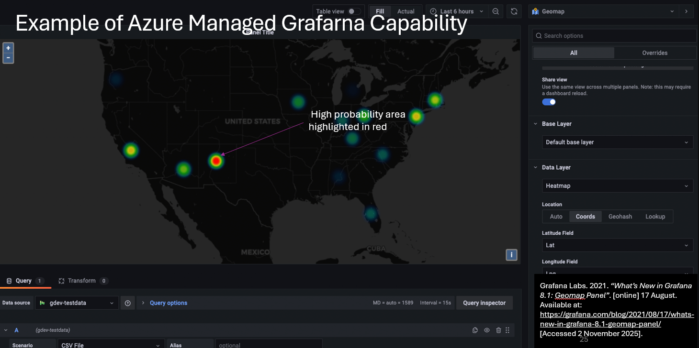
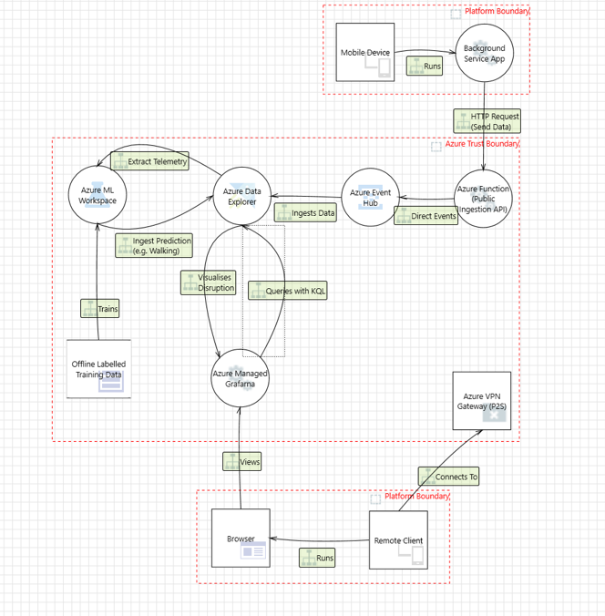
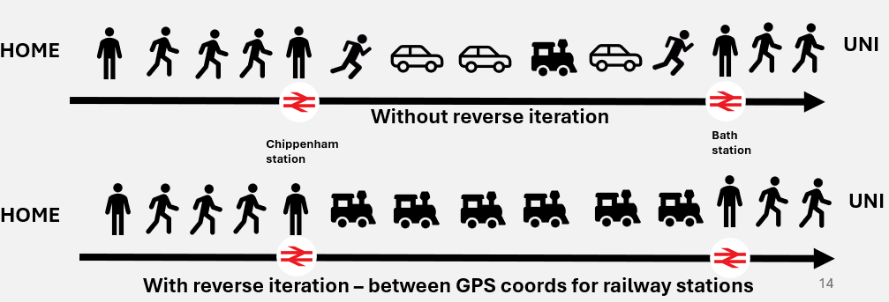

# IoT HAR Project

A conceptual Human Activity Recognition system to detect public disturbances through the use of pattern recognition with Machine Learning and Deep Learning models. 

The project uses the Tracks Logger Application, available on Android and iOS, to collect data for testing. 

- iOS: https://apps.apple.com/us/app/tracks-logger/id849620385
- Android: https://play.google.com/store/apps/details?id=com.peterhohsy.gpsloggerlite&hl=en_GB

The project aimed to identify the most suitable ML/DL algorithm and to design a conceptual system that could be implemented on the Microsoft Azure platform.

  

## Technologies and Expected Capabilities
As part of testing, Tracks Logger or any GPS-storing software can be utilised to obtain data for training and testing AI models. However, to be production-capable, a software application that collects real-time geolocation data would be required, with user consent. 

A heatmap is intended to identify areas where a disturbance is highly likely, as estimated by an instance of Grafarna.

### Anomalies, Architecture and Threat Modelling

Systems need to be enhanced to prevent data poisoning or data anomalies. A threat model highlights a prototype solution of a production system, including the Azure components, potential threats and trust boundaries. Where trust changes, the most critical threats, such as data poisoning or unauthorised access, could occur. 

Components of this prototype include:
- P2S VPN Gateway
- Azure Managed Grafarna
- Azure Data Explorer
- Azure ML Workspace
- Azure Event Hub
- Azure Function (not restricted by VPN access)

  

A reverse iteration method has also been utilised to prevent certain anomalies, such as ever-changing train speeds. This has been demonstrated below with an example train trip from Chippenham Station to Bath Station.

Other cases could include a car coming to a complete stop temporarily or a train entering a tunnel, resulting in a loss of GPS signal.

## Additional Info
The results of the AI, and further details regarding this topic, can be found within `docs/Project Presentation.pptx`, including the thought process behined the project and results of the Machine and Deep Learning models.
